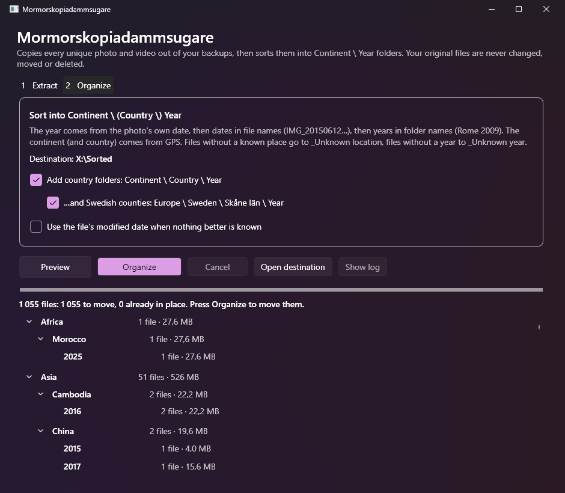
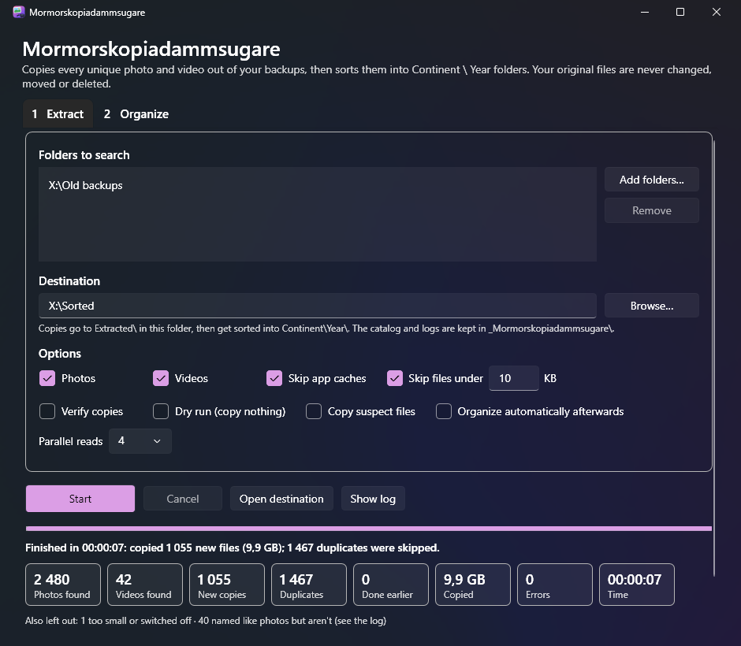

# Mormorskopiadammsugare

*Grandma's copy vacuum cleaner.* &nbsp;🇸🇪 *mormor* = grandma · *kopia* = copy · *dammsugare* = vacuum cleaner

Sucks every photo and video out of a pile of **backups of backups**, keeps exactly **one of each**,
and sorts them into **`Continent\Year\`** folders. A portable Windows app – no installation, one exe.

**Your original files are never changed.** By default everything is copied; the optional **move** mode
removes originals only after checking each copy – and can be undone.

📖 **[Manual](docs/MANUAL.md)** · **[Bruksanvisning på svenska](docs/MANUAL.sv.md)** · [What's new](CHANGELOG.md)



## What it does

1. **Extract** – point it at your old backup folders and a destination. It walks everything, finds
   every photo and video **by content** (renamed files, missing or wrong extensions, `FILE0001.CHK`
   from recovery tools…), and copies each unique one **once**. Duplicates are recognised by a
   SHA-256 fingerprint of the file's bytes, whatever their names.
2. **Organize** – shows a preview of the folder tree, then moves the copies into
   `Continent\Year\` – or, if you prefer, `Continent\Country\Year\`, with an extra **län** level for
   photos from Sweden (`Europe\Sweden\Skåne län\2015`). Switch any time; the next Organize just
   moves the already sorted files into the new layout.

```
Destination\
├─ Europe\2015\ …            ← GPS says Europe, photo taken 2015   (or Europe\Italy\2015\ …)
├─ Asia\_Unknown year\ …      ← GPS known, no date anywhere
├─ _Unknown location\2009\ …  ← no GPS, but "Rome 2009" folder / date in file name
├─ _Unknown location\2018\~Sweden\ …         ← best guess: GPS photos from the same hours agree
├─ _Unknown location\2018\Midsommar 2018\ …  ← best guess: the original album folder
├─ _Unknown location\_Screenshots\ …         ← screenshots, graphics and downloads set apart
├─ _Unknown location\_Unknown year\ …
└─ _Mormorskopiadammsugare\   ← catalog + CSV logs of every run
```

Also good to know:
- **Same name, different photo?** Both are kept (`IMG_0001.jpg`, `IMG_0001 (2).jpg`).
- **Same photo, many names?** One copy, with the best name among them – `Midsommar.jpg` beats
  `FILE0043.jpg`, and `(1)` / `- Copy` / `kopia` lose.
- **No GPS or no date?** Those files stay in the `_Unknown…` folders but get a **best attempt**: a probable
  place (`~Sweden`) when GPS photos taken within 3 hours agree, the original album folder, and screenshots,
  graphics and downloads in folders of their own. Guesses are marked with `~` and can be switched off.
- **Stock photos and memes** (recognised by file name) go one level deeper in their own folder:
  `Europe\Sweden\Skåne län\2016\_Stock & memes\` – out of the way, but right there to check.
- **Move instead of copy** (optional): empties the backups once each photo is safely in the new collection –
  never touching program folders, cloud folders or read-only files – and **Restore originals** undoes it.
- **Interrupted?** Press Start again – files already done are skipped, so it simply continues.
- **Skipped on purpose:** tiny thumbnails, app caches (`AppData`, browser caches), `Windows\`,
  macOS `._` files, `Thumbs.db`, and files that are named like photos but aren't (logged as *suspect*).



## Download

Get **`Mormorskopiadammsugare.exe`** from [Releases](../../releases) (Windows 10/11, 64-bit, ~64 MB,
self-contained – no .NET install needed). Put it in any folder and run it; settings are saved next to it.

Windows SmartScreen may say *"Windows protected your PC"* because the exe isn't code-signed
(*More info → Run anyway*). Instead of a signature, every release is **built by GitHub Actions from
this source** and carries a signed build attestation you can check:

```powershell
gh attestation verify Mormorskopiadammsugare.exe --repo codingdoctorbot/Mormorskopiadammsugare
```

`SHA256SUMS.txt` next to each download has the checksum (`Get-FileHash Mormorskopiadammsugare.exe`).

## How it decides

**Year** – first match wins:
1. The photo's/video's own capture date (EXIF, QuickTime/MP4, AVI). Camera "clock never set" dates
   like 2000-01-01 00:00 are ignored.
2. A date in a file name: `IMG_20150612_143005`, `VID-20160301-WA0001`, `Screenshot_2019-07-04…`
3. A year in the nearest folder name: `Rome 2009`, `2015-07 Lofoten` – but **not** folders named like
   backups (`Backup 2019`, `Säkerhetskopia`), whose year is when the backup was made.
4. Only if you tick the option: the file's modified date (off by default – backups reset it).

**Continent / country / län** – from GPS in the photo or video, looked up **offline** in country and
county outlines built into the exe ([Natural Earth](https://www.naturalearthdata.com)). Country folders use
short names (*United States*, *Serbia*); overseas territories get their own (*Réunion*, *French Guiana*). Photos taken from a boat or beach match the
nearest coast within 200 km. Russia east of the Urals and Asian Istanbul count as Asia; Réunion is
Africa and French Guiana South America, even though they're part of France.

## Formats

| Photos | Videos |
|---|---|
| JPEG, PNG, GIF, BMP, TIFF, WebP, HEIC/HEIF, AVIF, PSD, ICO | MP4, M4V, MOV, 3GP, AVI, MTS/M2TS/TS, MKV, WebM, WMV/ASF, MPG/VOB, FLV, DV |
| RAW: CR2, CR3, CRW, NEF, NRW, ARW, DNG, ORF, RW2, RAF, PEF, SRW, X3F, … | Dates/GPS read from MP4/MOV/3GP and AVI |

## Limitations

- Only **exact** duplicates are merged. A resized or re-compressed copy (e.g. sent via WhatsApp) is kept as
  a separate file.
- Continent is coarse on purpose; files without GPS (older cameras, scans, messaging apps) go to
  `_Unknown location` – often the biggest folder.
- MTS/MKV/WMV/MPG videos are dated only by file and folder names.
- ZIP archives are not opened.

## Tested on

- 126 automated tests (format detection, duplicates, resume, crash recovery, dates, 22 continent
  lookups, organizing).
- A generated 10 GB "backups of backups" pile made from Wikimedia Commons *featured pictures*
  (hard-linked backup copies, recovered and extension-less files, 595-character paths, junk) – the
  result matched an independent answer key exactly, also after cancelling halfway and resuming.
- Real camera and phone samples (iPhone, Android, Canon, Nikon, Sony, Fuji…; JPEG, HEIC, RAW, MOV, MP4, AVI).

## Building from source

Requires the [.NET 10 SDK](https://dotnet.microsoft.com/download) on Windows.

```powershell
dotnet test --solution PhotoSorter.sln                          # build + run the tests
dotnet publish src\PhotoSorter.App -p:PublishProfile=Portable   # → dist\Mormorskopiadammsugare\
```

Developer notes: [HANDOFF.md](HANDOFF.md) · spec: [docs/ARCHITECTURE.md](docs/ARCHITECTURE.md) ·
roadmap: [docs/TASKS.md](docs/TASKS.md) · history: [docs/SESSIONS.md](docs/SESSIONS.md). (The code's working title is `PhotoSorter`.)

## License

[MIT](LICENSE). Bundled components and their licenses: [THIRD-PARTY-NOTICES.md](THIRD-PARTY-NOTICES.md).
Provided as-is – it only ever copies, but keep your own backups anyway.
