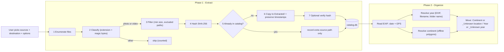
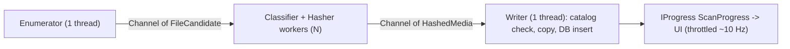

# Mormorskopiadammsugare – Architecture & Schematic

Portable Windows desktop app that digs through a huge pile of nested backups,
extracts every unique **photo and video**, and organizes them into
`Continent\Year\` folders.

**Designed for:** ~300 GB of mixed files, ~100 000 files, ~30 000 folders. The destination needs
room for the unique photos and videos (the app warns when it may run short).

> Naming: the spec says "media" for photos + videos. Code uses `MediaKind { Image, Video }`.

---

## 1. Tech stack

| Concern | Choice | Notes |
|---|---|---|
| Language / runtime | C# 14, .NET 10 (LTS, supported to Nov 2028) | `net10.0-windows` for the app, `net10.0` for core; SDK pinned in `global.json` |
| UI | WPF + MVVM | `CommunityToolkit.Mvvm` (source-generated ObservableProperty / RelayCommand) |
| Metadata | `MetadataExtractor` | EXIF/XMP/GPS for JPEG, HEIC, PNG, TIFF, WebP, RAW (CR2/CR3/NEF/ARW/DNG/…); QuickTime/MP4 + AVI dates/GPS for videos (verify per format in task 2.1) |
| Catalog / resume | `Microsoft.Data.Sqlite` | single `catalog.db` file in the destination |
| Hashing | `System.Security.Cryptography.SHA256` | HW-accelerated, disk-bound anyway |
| Continent lookup (Phase 2) | Natural Earth Admin-0 1:50m (offline, bundled) | Public domain – see §5.3 |
| Tests | xUnit v3 on Microsoft.Testing.Platform | `tests/PhotoSorter.Core.Tests` |
| Distribution | `dotnet publish` self-contained, single-file, win-x64 (`Portable.pubxml`) | output = one folder, no install |
| CI | GitHub Actions, `windows-latest` | build + test + upload portable exe |

---

## 2. Solution layout

```
PhotoSorter/
├─ PhotoSorter.sln
├─ Directory.Build.props          # shared: nullable, implicit usings, LangVersion
├─ HANDOFF.md                     # <- START HERE (status, next steps)
├─ docs/
│  ├─ ARCHITECTURE.md             # this file
│  └─ TASKS.md                    # phased checklist
├─ scripts/
│  ├─ build.ps1                   # dotnet build + test
│  └─ publish.ps1                 # portable folder -> dist/Mormorskopiadammsugare/
├─ src/
│  ├─ PhotoSorter.Core/           # ALL logic, no UI references (testable)
│  │  ├─ Models/                  # MediaKind, MediaFormat, ScanOptions, ScanProgress, records
│  │  ├─ Scanning/                # FileEnumerator
│  │  ├─ Detection/               # ExtensionRegistry, SignatureSniffer
│  │  ├─ Hashing/                 # FileHasher
│  │  ├─ Catalog/                 # CatalogDb (SQLite)
│  │  ├─ Extraction/              # ExtractionPipeline, CopyService, NameResolver
│  │  ├─ Logging/                 # CsvRunLog
│  │  ├─ Metadata/                # (Phase 2) MetadataReader, DateResolver
│  │  ├─ Geo/                     # (Phase 2) ContinentLocator
│  │  └─ Organizing/              # (Phase 2) FolderLayout, Organizer
│  └─ PhotoSorter.App/            # WPF shell (thin)
│     ├─ ViewModels/
│     ├─ Views/
│     └─ app.manifest             # longPathAware, PerMonitorV2 DPI
├─ tools/
│  └─ GeoPrep/                    # (Phase 2) Natural Earth -> src/PhotoSorter.Core/Geo/countries.gz
├─ tests/
│  └─ PhotoSorter.Core.Tests/
│     └─ TestData/                # tiny sample files per format
└─ dist/                          # publish output (git-ignored)
```

Rule: **`PhotoSorter.App` only does UI.** Everything that touches files lives in
`PhotoSorter.Core` behind async methods taking `IProgress<T>` + `CancellationToken`.

---

## 3. High-level flow



### Pipeline (producer/consumer)



- `System.Threading.Channels`, bounded (capacity ~256) so memory stays flat.
- **Worker count default = 4** (assumes an **SSD** source). Keep
  the option ("Parallel reads": 1–8) so HDD/USB sources can use 1.
- Single writer = no DB locking issues, deterministic collision naming.

---

## 4. Phase 1 details

### 4.1 Enumeration
- `new FileSystemEnumerable<FileCandidate>` / `Directory.EnumerateFiles` with
  `EnumerationOptions { RecurseSubdirectories = true, IgnoreInaccessible = true,
  AttributesToSkip = FileAttributes.ReparsePoint | FileAttributes.System }`
  - Skipping ReparsePoint avoids junction loops (`Application Data` etc.).
- Excluded folder names (configurable defaults): `$RECYCLE.BIN`,
  `System Volume Information`, `Windows`, `Program Files`, `Program Files (x86)`,
  `node_modules`, `.git`, and the **destination folder itself** (critical if the
  destination sits inside a source).
- Excluded file names: `Thumbs.db`, `desktop.ini`, `.DS_Store`, `._*` (macOS
  resource forks — they carry image extensions but are not images!).
- Captures: full path, size, LastWriteTimeUtc, CreationTimeUtc.

### 4.2 Classification (`Detection/`)

Decision table:

| Extension | Action |
|---|---|
| Known image/video ext | Sniff header to confirm. Match → media. Mismatch → still media if another *image/video* signature matches (wrong extension), else `Suspect` (logged, copied to `Extracted/_suspect/` only if option enabled). |
| No extension / unknown ext | Sniff header. Image/video signature → media (extension corrected on copy). |
| Known other ext (`.exe .dll .txt .doc(x) .pdf .mp3 .m4a .wav .wma .zip .7z .rar …`) | Skip without reading (fast). **Audio is not media.** |

Known image extensions:
`jpg jpeg jpe jfif png gif bmp dib tif tiff webp heic heif avif psd ico`
RAW: `cr2 cr3 crw nef nrw arw srf sr2 dng orf rw2 raf pef srw x3f 3fr mef mos erf kdc`

Known video extensions:
`mp4 m4v mov qt 3gp 3g2 avi mts m2ts ts mkv webm wmv asf mpg mpeg mpe vob flv dv`

Magic-byte signatures (read the first **512 bytes**; MPEG-TS needs sync bytes at 0/188/376, M2TS at 4/196/388):

**Images**

| Format | Offset | Bytes |
|---|---|---|
| JPEG | 0 | `FF D8 FF` |
| PNG | 0 | `89 50 4E 47 0D 0A 1A 0A` |
| GIF | 0 | `GIF87a` / `GIF89a` |
| BMP | 0 | `BM` + plausible header size at 14 (12/40/56/108/124) |
| TIFF-based (TIFF, CR2, NEF, ARW, DNG, PEF, SRW…) | 0 | `II*\0` or `MM\0*` (CR2: also `CR` at 8) |
| ORF | 0 | `IIRO` / `IIRS` / `MMOR` |
| RW2 | 0 | `IIU\0` |
| RAF | 0 | `FUJIFILMCCD-RAW` |
| WebP | 0 / 8 | `RIFF` …. `WEBP` |
| HEIC/HEIF/AVIF/CR3 | 4 | `ftyp` + brand at 8: `heic heix hevc hevx mif1 msf1 heim heis avif avis crx ` (**must** check brand — MP4/MOV also use `ftyp`) |
| PSD | 0 | `8BPS` |
| ICO | 0 | `00 00 01 00` (only trusted together with `.ico` ext – too weak alone) |

**Videos**

| Format | Offset | Bytes |
|---|---|---|
| MP4 / MOV / M4V / 3GP (ISO-BMFF) | 4 | `ftyp` with any brand **not** in the image list above and not audio (`M4A `, `M4B `, `M4P `). Typical: `isom iso2 mp41 mp42 avc1 qt   3gp4 3gp5 3g2a M4V  MSNV XAVC` |
| Old QuickTime (no `ftyp`) | 4 | atom type `moov` / `mdat` / `wide` / `free` / `skip` / `pnot`. Trust **only** with a `.mov`/`.qt`/`.mp4` ext (too weak alone) |
| AVI | 0 / 8 | `RIFF` …. `AVI ` (`RIFF`…`WAVE` = audio → skip) |
| MKV / WebM | 0 | `1A 45 DF A3` (EBML) |
| WMV / ASF | 0 | `30 26 B2 75 8E 66 CF 11` – also used by `.wma` audio, so trust only with a video ext or no ext |
| MPEG-PS (`.mpg .vob`) | 0 | `00 00 01 BA` |
| MPEG-TS (`.ts`) | 0, 188 | `47` sync byte at both |
| AVCHD (`.mts .m2ts`) | 4, 196 | `47` sync byte at both (192-byte packets) |
| FLV | 0 | `FLV` + `01` |
| DV | – | no reliable signature → extension only |

When the extension is a generic TIFF-container RAW, keep the original
extension (don't rename `.nef` → `.tif`). Same for ISO-BMFF video: keep
`.mov`/`.mp4`/`.3gp` as found; only add an extension when there is none.

### 4.3 Filters (defaults, all configurable)
- Min file size: **10 KB** (kills icons, web-cache crumbs, thumbnails). Same
  threshold for videos.
- Optional min pixel dimension (e.g. 256 px) — requires header read via
  MetadataExtractor; off by default in Phase 1 for speed.
- Exclude path fragments: `\AppData\`, `\Temporary Internet Files\`, `\Cache\`,
  `\thumbnails\` (toggle "Skip app caches", default ON).

### 4.4 De-duplication
- SHA-256 of full content, streamed with 1 MB buffer (`FileOptions.SequentialScan`).
  Videos can be several GB each. Report progress inside a file (bytes hashed) so
  the UI doesn't look frozen on a large video.
- Optimisation (optional, implement after correctness): group by size first;
  a size seen only once in the *whole* run + catalog can't be a duplicate — but
  we still hash it to store in the catalog for future runs. So: always hash;
  keep it simple.
- The catalog stores **every** source path for each hash (`sources` table).
  Duplicate folder names are valuable hints for later (e.g. `Vacation 2009`).

### 4.5 Copy
- Destination layout Phase 1: `<Dest>\Extracted\<originalName>.<ext>` (flat).
  - Name clash with *different* content → `name (2).jpg`, `name (3).jpg` …
  - Missing/wrong extension fixed from detected format.
- Copy to `name.ext.partial` then rename → never leaves half files after a
  crash/cancel.
- Preserve `LastWriteTimeUtc` and `CreationTimeUtc` from the source (oldest
  source copy wins if duplicates disagree — older = more likely original).
- Optional verify: re-hash destination file.
- Never write to, move, or delete anything in sources. Open sources with
  `FileAccess.Read, FileShare.ReadWrite`.
- Pre-flight: check destination free space ≥ estimated image bytes (after scan
  estimate) — warn, don't block.

### 4.6 Catalog (`<Dest>\_Mormorskopiadammsugare\catalog.db`)

```sql
CREATE TABLE media (
  id            INTEGER PRIMARY KEY,
  sha256        TEXT NOT NULL UNIQUE,
  size          INTEGER NOT NULL,
  kind          TEXT NOT NULL,          -- Image | Video
  format        TEXT NOT NULL,          -- MediaFormat enum name
  dest_path     TEXT,                   -- relative to destination root
  status        TEXT NOT NULL,          -- Copied | Suspect | Failed
  -- Phase 2 (nullable until filled)
  width INTEGER, height INTEGER,
  duration_sec  REAL,                   -- videos only
  date_taken    TEXT,                   -- ISO-8601 local
  date_source   TEXT,                   -- Exif | Xmp | QuickTime | Avi | FileName | FolderName | FileTime
  latitude REAL, longitude REAL,
  country TEXT,                         -- ISO code, free by-product of the polygon lookup
  continent TEXT,
  camera_make TEXT, camera_model TEXT,
  first_seen_utc TEXT NOT NULL
);
CREATE TABLE sources (
  id INTEGER PRIMARY KEY,
  media_id INTEGER NOT NULL REFERENCES media(id),
  source_path TEXT NOT NULL UNIQUE,
  size INTEGER NOT NULL,
  mtime_utc TEXT NOT NULL,
  ctime_utc TEXT NOT NULL
);
CREATE TABLE runs (id INTEGER PRIMARY KEY, started_utc TEXT, finished_utc TEXT,
                   options_json TEXT, stats_json TEXT);
```

**Resume:** if `sources.source_path` exists with same size + mtime → skip file
entirely (no hashing). Re-running after a cancel continues almost instantly.
Use WAL mode, `synchronous=NORMAL`; each new file = one small transaction (media + source row), so a crash loses at most the file being copied. Skipped files are only logged (no `skipped` table). Implemented columns also include `meta_version` (metadata cache), `year`, `year_source`, `continent`; `runs` has `kind` and `outcome`.

**Crash recovery:** leftover `*.partial` files are deleted at start; a copy that was finished but never recorded is recognised (same name, size and hash) and reused instead of copied again.

**Dry run:** works on an in-memory copy of the catalog (SQLite backup API), so already-catalogued files are still recognised but nothing on disk changes.

### 4.7 Run log
`<Dest>\_Mormorskopiadammsugare\logs\run-YYYYMMDD-HHMMSS.csv`
Columns: `timestamp,action,source_path,dest_path,sha256,size,format,message`
Actions: `Copied, CopiedSuspect, Duplicate, Skipped, Suspect, Error, Cancelled` (extract) and `Moved, Error` (organize, `organize-*.csv`).

### 4.8 Errors
Per-file try/catch → log + continue. Never abort the run for one file.
Typical: `UnauthorizedAccessException`, `IOException` (locked/bad sector),
`PathTooLongException` (shouldn't happen: modern .NET handles long paths itself, and the manifest is `longPathAware`).

---

## 5. Phase 2 – Organize: Continent → Year

Phase 2 reads metadata for every photo and video in the catalog, resolves **continent**
and **year**, then moves the files from `Extracted\` into the final tree.
(Date and location sorting are one step because the layout combines them.)

**Videos are mixed in with photos**: `Europe\2015\` holds
both, like a phone gallery. There is no separate video tree.

### 5.1 Final folder layout
```
<Destination>\
├─ Africa\ · Antarctica\ · Asia\ · Europe\ · North America\ · Oceania\ · South America\
│   ├─ 2009\
│   ├─ 2015\
│   └─ _Unknown year\            ← known location, missing year
├─ _Unknown location\
│   ├─ 2003\                     ← no GPS but known year (expected to be the BIGGEST bucket)
│   ├─ 2015\
│   └─ _Unknown year\            ← nothing known
├─ Extracted\                    ← Phase 1 staging (empty after organize, except failures)
└─ _Mormorskopiadammsugare\                 ← catalog.db, logs
```
**Optional levels** (Organize tab; switching later just moves files on the next Organize):
- *Country folders*: `Europe\Sweden\2015\` – short country names from GeoPrep's friendly-name list,
  overseas territories named on their own (`Africa\Réunion\`). No country level under `_Unknown location`.
- *Swedish counties* (needs country folders): `Europe\Sweden\Skåne län\2015\` for photos located in
  Sweden only – Natural Earth admin-1 1:10m, 21 län with Swedish names; a point outside every county
  polygon (archipelago, boat) takes the nearest county.

| Continent known? | Year known? | Folder |
|---|---|---|
| ✅ | ✅ | `Europe\2015\` |
| ✅ | ❌ | `Europe\_Unknown year\` |
| ❌ | ✅ | `_Unknown location\2015\` |
| ❌ | ❌ | `_Unknown location\_Unknown year\` |

Leading `_` makes the fallback folders sort to the top in Explorer.

### 5.2 Year resolution (`DateResolver`), stop at first hit
1. EXIF `DateTimeOriginal` → `DateTimeDigitized`; sanity range 1950-01-01 … today+1 (1950 so scanned prints dated by hand still count)
   (reject `0000:00:00`, `1970-01-01`; treat camera-default `2000-01-01`/`2002-01-01`
   as unknown if no other evidence).
2. XMP `photoshop:DateCreated` / `xmp:CreateDate`; HEIC/QuickTime create date.
   **Videos:**
   - MOV/MP4/3GP: `com.apple.quicktime.creationdate` (local time + offset) is
     preferred. Fall back to the `mvhd` creation time, which is **UTC** and counts
     from 1904-01-01. A zero value decodes as `1904-01-01`, so reject it.
   - AVI: `IDIT` / `DateTimeOriginal` chunk.
   - MTS/M2TS/MKV/WMV/MPG: usually nothing readable → steps 3–4.
3. File-name patterns (regex list, `Metadata/FileNameDatePatterns.cs`):
   - `IMG_20150612_143005`, `PXL_20210101_…`, `20150612_143005`
   - `IMG-20160301-WA0001` (WhatsApp), `WhatsApp Image 2016-03-01 at 12.00.00`
   - `Screenshot_2019-07-04-…`, `Photo 2014-08-02 …`, `2014-08-02 13.45.10`
   - Videos: `VID_20150612_143005`, `VID-20160301-WA0001`, `PXL_20210101_….mp4`,
     AVCHD `00012.MTS` has **no** date in its name (expect `_Unknown year` unless the folder name helps)
4. Folder names of any source path (from `sources`): `2009`, `2009-07 Rome`, `Summer 2012`
   (4-digit 1950–now as a whole token; ignore tokens like `20150612` handled above). The **nearest** folder
   above the file wins; folders named like backups (`Backup 2019`, `Säkerhetskopia`, `Time Machine`, `bak`) are
   skipped, because their year is when the backup was made. If copies disagree, the **oldest** year wins.
5. File modified time → **NOT trusted by default** (backups often reset it to
   the backup date). Option "Use file dates as last resort" (default OFF). When
   off, these images go to `_Unknown year\`. `date_source` stored either way.

### 5.3 Continent resolution (`Geo/ContinentLocator`)
- GPS from EXIF (`GpsDirectory.TryGetGeoLocation`); reject `(0,0)` and out-of-range.
- Video GPS: QuickTime `com.apple.quicktime.location.ISO6709` (iPhone) or
  the `©xyz` user-data atom (Android/GoPro), both ISO 6709 strings like
  `+59.3293+018.0686/`. Most other video formats → no GPS → unknown.
- Offline data: Natural Earth **Admin-0 countries 1:50m** (public domain, no
  attribution required) pre-processed by `tools/GeoPrep` into
  `src/PhotoSorter.Core/Geo/countries.gz` (embedded in the exe, ~630 KB): per country → ISO code, continent, polygons.
  (Not `countries.bin.gz`: MSBuild reads `.bin.` as the culture "Bini" and moves it to a satellite assembly.)
  Overseas parts get their own continent: Réunion/Mayotte → Africa, French Caribbean/Dutch Caribbean → North America,
  French Guiana → South America; Natural Earth "Seven seas" islands use their UN region.
- Lookup: bounding-box prefilter (boxes computed at load, smallest first) → point-in-polygon
  (even-odd over all rings, so holes like Lesotho work). Store **country + continent** in the catalog.
- Not inside any polygon (beach/boat/coastal simplification) → nearest polygon
  edge within **200 km**, else unknown.
- Fix-ups for trans-continental countries (Natural Earth puts all of Russia in
  Europe): Russia lon ≥ 60°E or ≤ −160° (Chukotka) → Asia; Turkey → Europe only inside a small
  East Thrace polygon (north/west of Dardanelles – Marmara – Bosporus), else Asia;
  Egypt Sinai stays Africa (keep simple); Kazakhstan is already Asia in the data.
- Continent names: Africa, Antarctica, Asia, Europe, North America, Oceania,
  South America (Central America + Caribbean → North America).
- No GPS → unknown.

### 5.4 Organize operation (`Organizing/Organizer`)
- **Preview first**: tree with counts per folder (e.g. `Europe\2015 – 1 204 files`).
- Then **move within destination** (files there are our copies, sources stay
  untouched). Same-volume move = instant rename, no extra space needed.
- Name clashes → `name (2).jpg`. Update `dest_path` in catalog, log every move.
- Re-runnable: images already in the correct folder are skipped; if a later
  run finds better info (new duplicate with EXIF), the file moves.
- Option "Organize automatically after extract" (default ON).
- Metadata reading is parallel (SSD) – default 4 workers.

### 5.5 Best guesses inside the unknown folders (`Organizing/BestGuess`, option, default on in the UI)
Files stay under `_Unknown location` / `_Unknown year`, but are sorted further. Guesses are marked and
recorded in the catalog (schema v2: `guess_place`, `guess_reason`, `album`, `category`) and in the organize log.

```
_Unknown location\
   2018\
      ~Sweden\              ← probable place (country folders on; "~Europe" otherwise)
      Midsommar 2018\       ← original album folder (3+ files share it)
   _Screenshots\2019\  _Graphics\_Unknown year\  _Downloads\2015\
Europe\_Unknown year\Rome trip\   ← album folders also where the year is unknown
```

1. **Place from photos taken at the same time** – a no-GPS photo with a real capture time (EXIF, QuickTime,
   AVI; never file dates) gets `~<place>` when **all** GPS photos within **±3 h** agree on the place (country
   with country folders on, else continent). Disagreement (border, flight) → no guess. Typical case: camera
   without GPS + phone with GPS on the same trip.
2. **Album folders** – the nearest meaningful folder name above the file (up to 4 levels), most common among
   all copies. Skipped: generic names (DCIM, Pictures, Bilder, Desktop, Downloads…), camera folders (100CANON,
   plain numbers), device names (SD card, Minneskort, iPhone, Mobil…), our own folders (`Extracted`, `_…`,
   `~…`). The search stops at backup folders, at user-profile folders (`Users\<name>` – a person's name is
   never an album) and at the **source folders the user added** (read from the runs' saved options). Only
   used when **≥ 3 files** share the album in the same bucket.
3. **Non-photos apart** (unknown location only): `_Screenshots` (screenshot names/folders), `_Graphics`
   (PNG/GIF/BMP/ICO/PSD/WebP without camera data), `_Downloads` (**every** copy in a Downloads folder).
   No album or place guess inside these.

### 5.6 Stock photos and memes (option, default on in the UI)
In **every** final folder, files whose name (any copy) looks like a stock-site download or a meme/web image go
one level deeper: `Europe\Sweden\Skåne län\2016\_Stock & memes\`. Checked before the unknown-folder guesses.
Name patterns: stock agencies (Shutterstock, iStock, Getty, Adobe Stock, Depositphotos, 123RF, Dreamstime,
Fotolia, Bigstock, Freepik, Pexels, Unsplash, Pixabay, Alamy…), meme sites (meme, 9GAG, Imgflip, iFunny),
Discord (`image0.png`, `unknown.png`), Reddit (13 random lower-case/digits), Twitter/X (15 random mixed-case),
Tumblr, Facebook-saved (`FB_IMG_<13 digits>`), Messenger (`received_<digits>`). Name-based only: false
positives are accepted because they stay in the same folder, easy to inspect. `FB_IMG_` numbers are the save
time, not the capture time, so they are not used as a year.

## 6. Later ideas (not planned)
- Guess location from folder names (`Thailand 2012`, `Rome`) for no-GPS photos.
- Country/city sub-levels (catalog already stores country).

## 7. UI (WPF, single window, tabs)

```
┌ PhotoSorter ───────────────────────────────────────────────────────┐
│ [1 Extract] [2 Organize (Continent → Year)] [Log]                  │
├────────────────────────────────────────────────────────────────────┤
│ Sources:  ┌──────────────────────────────────────┐ [Add…][Remove]  │
│           │ E:\Backups                           │                 │
│           │ F:\Old laptop backup                 │                 │
│           └──────────────────────────────────────┘                 │
│ Destination: [ D:\Photos_Sorted              ] [Browse…]           │
│ Options: [x] Skip files < [10] KB   [x] Skip app caches            │
│          [ ] Verify copies          [ ] Dry run (no copying)       │
│          Parallel reads: [4 ▾]      [ ] Copy suspect files         │
│          [x] Photos  [x] Videos                                    │
│ [ Start ]  [ Cancel ]                                              │
│ ████████████░░░░░░░░  48 213 / ~100 000 files                      │
│ Found 21 455 (19 870 photos · 1 585 videos) · Unique 9 870 · Dupes │
│ Copied 8.2 GB · Skipped 26 758 · Errors 3 · Elapsed 00:14:22       │
│ Current: E:\Backups\2012\Backup of backup\DCIM\IMG_0042.JPG        │
└────────────────────────────────────────────────────────────────────┘
```

- Progress updates throttled (~10/s) via `IProgress<ScanProgress>`.
- Total count unknown upfront: optional fast "count" pre-pass (enumeration only,
  takes seconds-minutes) to give a real percentage — implement as step 0.
- Settings persisted to `settings.json` **next to the exe** (portable).

## 8. Portability / publish
```
dotnet publish src/PhotoSorter.App -p:PublishProfile=Portable
```
Settings live in `src/PhotoSorter.App/Properties/PublishProfiles/Portable.pubxml`:
Release, win-x64, self-contained, single file, native libraries embedded, compressed,
no debug symbols, output to `dist/Mormorskopiadammsugare/`.
Result: `dist/Mormorskopiadammsugare/Mormorskopiadammsugare.exe` (country polygons are embedded). Copy the folder
anywhere, run. No .NET install needed on target PC.
